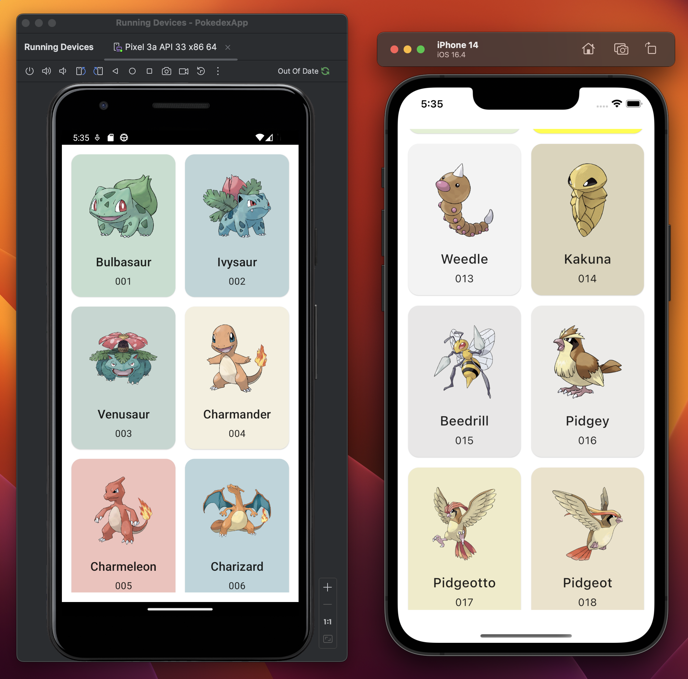

# PokedexApp

This is a pokedex app using KMP (Kotlin Multiplatform), using the [PokeAPI](https://pokeapi.co/) api to display information about pokemon.

UI Inspiration: [Sulis Triyono](https://dribbble.com/shots/16833947-Mobile-Pokedex-App-Design-Exploration)

## Screenshot of current version

